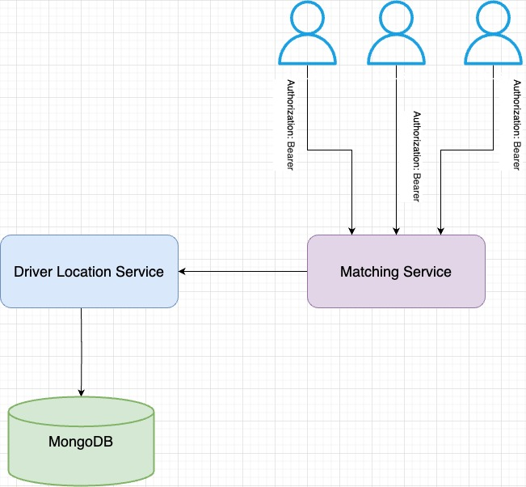

# Bitaksi Golang Case Study

## Overview

The project consists of two services:

### Driver Location Service

This service is responsible for storing and retrieving driver locations. It provides the following endpoints:

  - `POST /drivers`: Stores the location of a driver.
  - `POST /drivers/bulk`: Stores the locations of multiple drivers.
  - `POST /drivers/upload`: Stores the locations of multiple drivers using a CSV file.
  - `POST /drivers/search`: Searches for the nearest driver to a given location within a given radius.
  - `GET /healthz`: Retrieves the health status of the service.
  - `GET /swagger/index.html`: Retrieves the Swagger UI documentation of the service.
  
  You can find the more detailed documentation of the service in Swagger UI.

### Matching Service

This service is responsible for matching passengers with drivers. It provides the following endpoints:
- `POST /match`: Matches a passenger with the nearest driver.
- `POST /token`: Generates a JWT token for the `{authenticated: true}` claim.
- `GET /swagger/index.html`: Retrieves the Swagger UI documentation of the service.

  You can find the more detailed documentation of the service in Swagger UI.

## Architecture

You can find the architecture diagram of the project below:



The services are containerized using Docker and orchestrated using Docker Compose. The `driver-location` service uses MongoDB as the database to store driver locations. The `matching` service uses the `driver-location` service to retrieve driver locations and match passengers with drivers.

## How to run

### Prerequisites

- Docker
- Docker Compose
- Go

### Configuration

**Driver Location Service**

Create a `.env` file in the `driver-location` directory and add the following variables:

```bash
PORT=8080
DB_NAME=bitaksi
DB_URI=mongodb://mongo:27017
COLLECTION_NAME=locations
```

**Matching Service**

Create a `.env` file in the `matching` directory and add the following variables:

```bash
JWT_SECRET=secret
DRIVER_LOCATION_SERVICE_URL=http://driver-location:8080
PORT=8081
```

### Build

```bash
docker-compose build --parallel
```

### Run

```bash
docker-compose up -d
```

Then you can access the services at the following URLs:

- Driver Location Service: http://localhost:8080
- Matching Service: http://localhost:8081

## How to test

For testing the services, you can use the following commands:

**Driver Location Service**
```bash
cd driver-location
go test -v ./... -cover
```

**Matching Service**

```bash
cd matching
go test -v ./... -cover
```